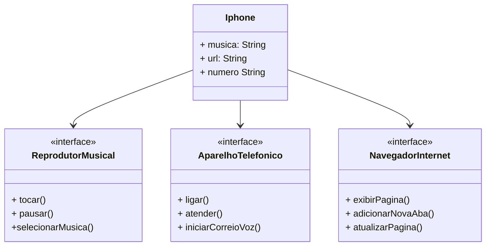

# Projeto desafio DIO modelando iPhone com UML 

🚀 Tecnologias e Linguagens 
- **JAVA**
- **UML**

## Diagrama de classe 

```mermaid

classDiagram 

class Iphone {

+ musica: String
+ url: String
+ numero String

}


class ReprodutorMusical {
<<interface>>

+ tocar() 
+ pausar() 
+selecionarMusica() 

}

class AparelhoTelefonico {
<<interface>>

+ ligar() 
+ atender() 
+ iniciarCorreioVoz() 

}

class NavegadorInternet {
 <<interface>>

+ exibirPagina() 
+ adicionarNovaAba() 
+ atualizarPagina() 

}


Iphone --> ReprodutorMusical

Iphone --> AparelhoTelefonico

Iphone --> NavegadorInternet

```
